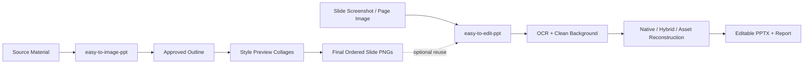

<p align="center">
  
</p>


# EasyToPPT

> Two Codex skills for turning raw material, slide images, papers, screenshots, and visual references into polished PPT assets.

<p align="center">
  <strong>EasyToPPT = Image PPT generation + Editable PPT reconstruction</strong>
</p>


<p align="center">
  <a href="https://invinciby.github.io/Eeay-To-PPT/">Web Page</a> ·
  <a href="#-what-is-this">Overview</a> ·
  <a href="#showcase">Showcase</a> ·
  <a href="#-the-two-skills">Skills</a> ·
  <a href="#-workflow">Workflow</a> ·
  <a href="#-project-structure">Structure</a> ·
  <a href="#-quick-start">Quick Start</a>
</p>


---

## ✨ What Is This

**EasyToPPT** packages two complementary Codex skills into one presentation automation project:

- **Easy To Image PPT** turns source material into an ordered folder of beautiful 16:9 slide images.
- **Easy To Edit PPT** reconstructs slide screenshots or page images into editable `.pptx` files.

Together, they cover both sides of modern PPT creation: **generate visually impressive slide pages from content**, then **recover or rebuild slides as editable PowerPoint decks when needed**.

## Showcase

Four primary examples generated with the EasyToPPT workflow.

| Scientific Editorial                                         | Agentic Dark                                                 |
| ------------------------------------------------------------ | ------------------------------------------------------------ |
|  |  |
| Knowledge graph, literature, AI agent, validation pathways, and scientific discovery flow in a clean editorial style. | A dark neon agent-loop presentation style for LLM-driven hypothesis generation and validation. |

| Hand-Drawn Explainer                                         | Chalkboard Reasoning                                         |
| ------------------------------------------------------------ | ------------------------------------------------------------ |
|  |  |
| A playful sketch-note style showing the path from computational oracle to autonomous partner. | A blackboard-style scientific reasoning map with hypothesis space, scoring, causal reasoning, and validation. |

## 🚀 The Two Skills

| Skill               | Output                   | Best For                                                     | Core Promise                                                 |
| ------------------- | ------------------------ | ------------------------------------------------------------ | ------------------------------------------------------------ |
| `easy-to-image-ppt` | Ordered PNG slide images | Papers, reports, experiment notes, Markdown, pasted text, reference material | Build a faithful Chinese academic/report slide image set through outline approval, style previews, Image2 generation, QA, and ordered delivery |
| `easy-to-edit-ppt`  | Editable `.pptx`         | Slide screenshots, page images, existing visual PPT pages    | Reconstruct editable text, native shapes, local visual assets, clean backgrounds, OCR results, validation reports, and region-level editability boundaries |

### `easy-to-image-ppt`

This skill is a **full-slide image deck generator**. It does not create native PowerPoint objects. Instead, it builds a controlled pipeline for generating final slide images:

1. Analyze the user's source material.
2. Propose a title, page count, outline, and slide titles.
3. Wait for outline approval.
4. Generate per-slide content grounded in the source.
5. Produce a canonical Markdown production pack.
6. Generate multiple full-deck visual preview collages.
7. Wait for style direction approval.
8. Generate final ordered 16:9 slide images.
9. Run QA for Chinese text, layout, factual faithfulness, and strict figure preservation.

It is designed for Chinese academic/report PPT image sets where **visual quality matters**, but **unsupported data or invented claims are forbidden**.

### `easy-to-edit-ppt`

This skill is an **image-to-editable-PPT reconstruction workflow**. It accepts one or more slide/page images and produces a `.pptx` with editable text and PowerPoint objects where practical.

Its pipeline includes:

1. Run directory creation.
2. OCR with configured credentials.
3. Normalized layout and text extraction.
4. Clean background generation through image editing.
5. Region classification into native, hybrid, and asset areas.
6. PPTX construction with layered backgrounds, shapes, visual assets, and editable text.
7. Text/layout calibration.
8. Validation, visual comparison, and repair loops.
9. Final report describing editable regions and visual-fidelity tradeoffs.

It is designed around a pragmatic principle: **make text and simple structure editable, keep dense visuals as movable local assets when that better preserves fidelity**.

## 🧠 Workflow



## 🔥 Why It Stands Out

- **Dual output modes**: final slide images and editable `.pptx`.
- **Approval-gated generation**: outline and visual direction are approved before expensive final generation.
- **Grounded content policy**: no invented data, results, citations, or claims.
- **Strict figure protection**: experiment plots, screenshots, medical/lab images, and data figures are preserved instead of redrawn.
- **Region-level editability**: reconstruction reports what is native, hybrid, or asset-based.
- **Repair-aware pipeline**: validates outputs and supports targeted second-pass improvement.

## 📦 Project Structure

```text
EasyToPPT/
├─ EasyToEditPPT/
│  └─ easy-to-edit-ppt-skill/
│     ├─ SKILL.md
│     ├─ scripts/
│     ├─ references/
│     ├─ server/
│     ├─ pyproject.toml
│     ├─ package.json
│     └─ ocr_setting.example.json
├─ EasyToImagePPT/
│  └─ easy-to-image-ppt/
│     ├─ SKILL.md
│     ├─ references/
│     ├─ examples/
│     ├─ scripts/
│     └─ agents/
├─ README.md
└─ index.html
```

## ⚡ Quick Start

Clone the repository and inspect the two skill folders:

```bash
git clone https://github.com/<your-name>/EasyToPPT.git
cd EasyToPPT
```

For image slide generation, use:

```text
EasyToImagePPT/easy-to-image-ppt/SKILL.md
```

For editable PPT reconstruction, use:

```text
EasyToEditPPT/easy-to-edit-ppt-skill/SKILL.md
```

If using `easy-to-edit-ppt`, configure OCR credentials from the example:

```bash
cp EasyToEditPPT/easy-to-edit-ppt-skill/ocr_setting.example.json \
   EasyToEditPPT/easy-to-edit-ppt-skill/ocr_setting.json
```

Then fill:

```json
{
  "apiUrl": "your OCR job endpoint",
  "accessToken": "your token",
  "timeoutMs": "180000"
}
```

> Do not commit real OCR tokens. Keep `ocr_setting.json` local.

## 🖼️ Web Showcase

Open [`index.html`](./index.html) locally to view the project landing page.

It is a static, dependency-free showcase page suitable for GitHub Pages:

1. Push the repository to GitHub.
2. Go to **Settings → Pages**.
3. Select the repository root as the source.
4. Visit the generated GitHub Pages URL.

## 🛡️ Design Philosophy

EasyToPPT is built around one practical belief:

> PPT automation should respect both visual fidelity and editability.

Some workflows need stunning final slide images. Some need fully editable PowerPoint decks. Some need a hybrid. This project gives Codex a structured way to choose the right path instead of forcing every slide through the same brittle conversion strategy.

## 📄 License

Check the license files inside each skill directory before redistribution.
